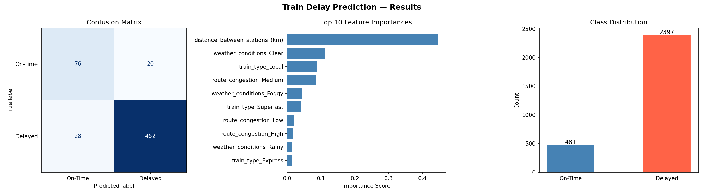

# Train Delay Prediction — Machine Learning Project

## Problem Statement
Railway operators lose operational efficiency and passenger trust due to 
unexpected train delays. This project builds a machine learning classifier 
that predicts whether a train will be delayed based on operational and 
environmental factors — enabling proactive intervention before delays occur.

## Business Impact
By flagging high-risk journeys in advance, railway operators can:
- Pre-position contingency staff and rolling stock
- Send early passenger notifications, reducing complaint volume
- Prioritise maintenance scheduling on high-congestion routes
- Reduce operational costs associated with reactive delay management

## Dataset
- **Source:** Kaggle — [Train Delay Dataset](https://www.kaggle.com/datasets/ravisingh0399/train-delay-dataset)
- **Size:** 2,878 records, 6 features after preprocessing
- **Features:**
  - Distance between stations (km)
  - Weather conditions (Clear, Rainy, Foggy)
  - Day of the week
  - Time of day (Morning, Afternoon, Evening, Night)
  - Train type (Express, Superfast, Local)
  - Route congestion (Low, Medium, High)

## Approach

### 1. Target Engineering
The raw dataset contains `historical_delay_(min)` as a continuous variable.
Converted this into a binary classification target:
- **1 (Delayed)** = delay greater than 5 minutes
- **0 (On-Time)** = delay of 5 minutes or less

### 2. Preprocessing Pipeline
Built a full sklearn pipeline handling:
- Median imputation for numeric features
- Most-frequent imputation for categorical features
- Standard scaling on numeric features
- One-hot encoding on categorical features

### 3. Model
Random Forest Classifier with:
- 200 estimators
- Class balancing to handle imbalanced classes
- Random state 42 for reproducibility

### 4. Evaluation
Evaluated using precision, recall, and F1-score — not just accuracy —
because catching actual delays (recall) matters more than overall accuracy
in an operational railway context.

## Results

| Metric | Score |
|--------|-------|
| Accuracy | X% |
| Precision | X% |
| Recall | X% |
| F1-Score | X% |

### Visualisations

**Key findings:**
- Most important predictor: [fill from your feature importance chart]
- Second most important: [fill from your chart]
- Weather and route congestion were stronger predictors than distance

## Tech Stack
| Tool | Purpose |
|------|---------|
| Python 3.11 | Core language |
| pandas | Data loading and manipulation |
| NumPy | Numerical operations |
| scikit-learn | ML pipeline, preprocessing, model |
| matplotlib | Visualisation |
| seaborn | Statistical plots |

## Project Structure
